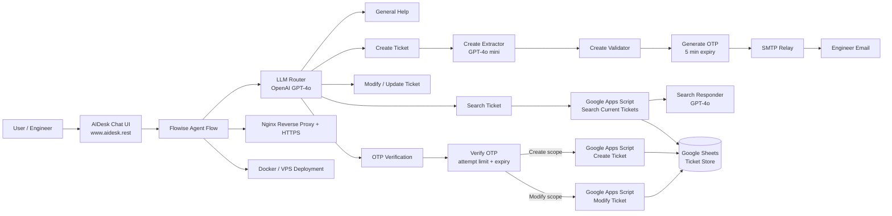
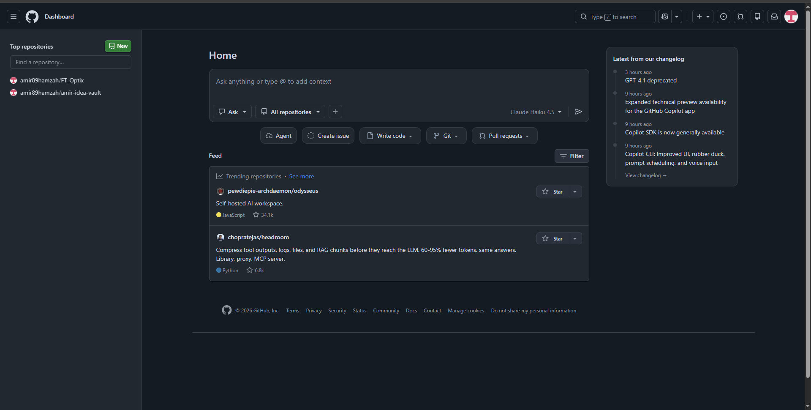

# AIDesk — LLM Ticketing System

**AIDesk** is a production-deployed LLM-based ticketing workflow for engineering support.

It allows a user to chat with a bot, create a support ticket, search existing tickets, modify/update a ticket, verify sensitive actions through OTP email, and store/retrieve ticket records from Google Sheets through a workflow backend.

Live demo:

> https://www.aidesk.rest

> Note: this repository documents the architecture and implementation approach. Production secrets, active Google Apps Script deployment IDs, spreadsheet IDs, SMTP credentials, and private environment variables are intentionally excluded or redacted.

---

## Why this project exists

Technical support requests are often incomplete, scattered across chat/email, and hard to track. AIDesk converts a natural-language support request into a structured ticket workflow.

The main goal is not to build a generic chatbot. The goal is to build a controlled workflow that can:

- understand user intent,
- collect required support ticket fields,
- validate missing information,
- protect create/modify actions with OTP,
- store and retrieve ticket records,
- support engineering-style search and summaries,
- keep a traceable workflow for technical support operations.

---

## Core capabilities

- Conversational ticket creation
- Intent routing: `general`, `create`, `edit`, `search`, `otp_verify`
- Structured field extraction for ticket data
- Missing-field validation before ticket submission
- OTP generation with expiry
- OTP verification with attempt limit and lockout handling
- Create ticket workflow
- Modify/update ticket workflow
- Search existing tickets from the latest/current ticket records
- Email notification through SMTP relay
- Google Sheets storage through Google Apps Script
- Flowise Agent Flow implementation
- Deployed behind Nginx reverse proxy with HTTPS
- Uses OpenAI models: GPT-4o and GPT-4o mini

---

## Ticket fields

AIDesk collects these fields:

| Field | Purpose |
|---|---|
| `engineer_email` | Engineer who creates or modifies the ticket |
| `system` | Equipment/system involved |
| `site` | Plant, project, platform, or customer site |
| `pic` | Person-in-charge / customer contact |
| `problem_title` | Short summary of issue |
| `action_description` | Main troubleshooting/action details |
| `start_date` | Date support started |
| `end_date` | Date support ended, or `OPEN` if still ongoing |
| `case_id` | System-generated ticket ID |

Example case ID format:

```text
CASE-YYYYMMDD-###
```

---

## High-level architecture



See [`docs/architecture.md`](docs/architecture.md) for a more detailed breakdown.

---

## Technology stack

| Area | Technology |
|---|---|
| Agent workflow | Flowise Agent Flow |
| LLM provider | OpenAI |
| Models | GPT-4o, GPT-4o mini |
| Ticket storage | Google Sheets |
| Backend workflow | Google Apps Script webhook |
| Email delivery | SMTP relay |
| Runtime | Docker / Docker Compose |
| Hosting | VPS |
| Reverse proxy | Nginx |
| Public access | HTTPS domain |
| Data format | JSON |
| Verification | Email OTP |

---

## Flowise canvas overview



The full exported Flowise JSON is included in redacted form:

- [`flowise/exported-flow-redacted.json`](flowise/exported-flow-redacted.json)
- [`flowise/node-labels.csv`](flowise/node-labels.csv)
- [`docs/flowise-node-map.md`](docs/flowise-node-map.md)

---

## Repository structure

```text
aidesk-llm-ticketing-system/
│
├── README.md
├── docs/
│   ├── architecture.md
│   ├── workflow.md
│   ├── flowise-node-map.md
│   ├── deployment-notes.md
│   ├── implementation-guide.md
│   ├── security-notes.md
│   ├── lessons-learned.md
│   └── roadmap.md
│
├── samples/
│   ├── ticket-payload.example.json
│   ├── create-ticket-request.example.json
│   ├── modify-ticket-request.example.json
│   ├── otp-payload.example.json
│   ├── bot-log.example.json
│   └── email-template.example.md
│
├── flowise/
│   ├── exported-flow-redacted.json
│   └── node-labels.csv
│
├── assets/
│   ├── architecture.mmd
│   └── screenshots/
│       └── flowise-canvas-overview.png
│
├── .env.example
├── docker-compose.example.yml
├── SECURITY.md
└── LICENSE
```

---

## Example user prompts

Create a ticket:

```text
Create ticket. Engineer email engineer@example.com. System RGTSU. Site Kerteh. PIC Prem. Problem title HMI freeze. Action description screen freezes after login. Start date 2026-01-10. End date open.
```

Search a ticket:

```text
Search ticket CASE-20260110-001
```

Modify a ticket:

```text
Modify CASE-20260110-001, append action_description: Checked power supply and restarted HMI.
```

Verify OTP:

```text
123456
```

---

## Implementation highlights

### 1. LLM router

The first LLM classifies the user message into one of the supported routes:

- general/help
- create ticket
- modify/update ticket
- search ticket
- OTP verification

### 2. State-based workflow

Flowise runtime state is used to carry ticket fields, OTP status, OTP expiry, temporary draft values, and modification scope across turns.

### 3. Controlled actions

Create and modify workflows do not directly commit data immediately. They first validate required fields and then require OTP verification.

### 4. Search responder

The search flow retrieves current ticket rows and uses an LLM responder to summarize or explain the result naturally.

### 5. Email OTP

OTP is generated inside the workflow, sent through an SMTP relay, and verified with:

- expiry check,
- attempt count,
- lockout after repeated failures,
- scope handling for create vs modify.

---

## Security and privacy

This public version redacts or excludes:

- production `.env`,
- OpenAI credentials,
- SMTP credentials,
- Google Apps Script deployment ID,
- Google Sheet ID,
- private user/customer emails,
- real ticket data,
- VPS access details,
- internal company/client documents.

See [`docs/security-notes.md`](docs/security-notes.md).

---

## Project status

Production deployed.

This repository is prepared as a public technical portfolio version. It documents the production architecture and workflow while removing secrets and private operational data.

---

## Career relevance

This project demonstrates practical experience in:

- LLM workflow automation,
- AI-assisted ticketing,
- support process automation,
- user-intent routing,
- OTP verification flow,
- API/JSON workflow design,
- deployment and reverse proxy setup,
- customer-facing technical support automation,
- bridging industrial support experience with AI workflow engineering.

Relevant target roles:

- AI Automation Solutions Engineer
- Azure AI / Copilot Solutions Engineer
- Technical Consultant — AI Automation
- Workflow Automation Engineer
- Customer Success Engineer — AI Platform
- Industrial AI / OT-AI Integration Engineer
- Solutions Engineer — Automation / AI

---

## Author

Amir Hamzah Sarihan  
LinkedIn: https://www.linkedin.com/in/amir89hamzah/
